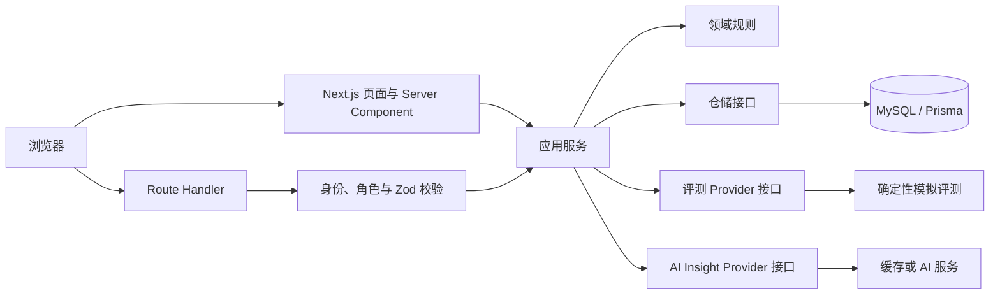

# SimEval 架构设计

**状态：架构边界已确定，阶段 2 本地交付已签收。** Next.js 应用源码、Prisma schema、迁移 SQL、仓储与会话代码已建立；本地开发库的初始迁移、两次 Seed、演示登录与持久化概览路径，以及独立测试库的集成测试已通过。空／错误状态的真实浏览器走查仍缺单独记录。评测与 AI Provider 尚未运行。设计与实现差异以对应功能规格和代码核对。

## 产品与运行边界

SimEval 是具身智能团队的评测数据工作台。黄金路径从数据集质量检查开始，经模拟评测、版本对比、异常样本复核和数据回补，最终生成并人工确认报告。界面与业务流程计划真实实现；数据质量结果、评测执行和演示样本采用确定性的合成数据。系统不运行真实机器人仿真器、不训练模型，也不建设通用数据 ETL。

## 计划中的模块化单体

| 层 | 职责 |
|---|---|
| Next.js 页面与 Server Component | 页面组合与首屏读取；不保存业务规则 |
| Route Handler | 客户端写操作、轮询与 AI 请求的 HTTP 入口；统一处理身份、角色、参数、错误和幂等 |
| 应用服务 | 完成一次业务动作，组织领域规则、Provider、仓储与事务 |
| 领域层 | 数据质量门禁、评测与复核状态机、指标比较规则、报告证据规则 |
| 仓储层 | 隔离 Prisma 对 MySQL 的访问；页面组件不直接写数据库 |
| Provider | `MockEvaluationProvider` 提供可重复的模拟评测；`InsightProvider` 隔离 AI 分析并提供缓存或降级实现 |

箭头表示调用方向，不表示独立部署；这些模块都位于同一应用中。仓储和 Provider 实现通过接口进入应用服务，路由层不直接写数据库。

采用 Next.js、TypeScript、Prisma、MySQL、Auth.js；不引入微服务、消息队列或 WebSocket。客户端组件不得访问 Prisma、密钥或仅服务端可用的模块。

## 数据与关键事务

主要实体包括用户与角色、项目、模型版本、数据集版本、质量检查、Benchmark、评测任务、指标结果、异常样本、复核记录、回补任务、AI 报告和审计记录。阶段 2 已写出 [Prisma schema](../prisma/schema.prisma) 与初始迁移 SQL，并在项目专用数据库和独立测试库应用迁移、两次写入 Seed；测试库已核对固定记录、关系和重复运行结果。唯一约束冲突、索引表现和后续下钻查询的集成验证属于后续功能切片。

- 生成评测结果时，任务状态、指标、异常样本与审计记录保持一致。
- 完成复核并按需创建回补任务时，复核结论、样本状态、回补任务与审计记录同事务提交。
- 生成报告时，服务端组装有限输入，校验指标和样本证据后保存草稿；人工确认是独立的受权状态流转。

## 契约与待决事项

[OpenAPI 契约](openapi.yaml)是 HTTP 方法、参数、响应和错误的机器可读出处；[接口说明与示例](api-contract.md)保留黄金路径示例与尚待决定的业务细节。具体功能的可验收行为写入 `specs/<功能>/spec.md`，实现前解决该切片涉及的未决项。这里的设计文字不证明接口已实现。
