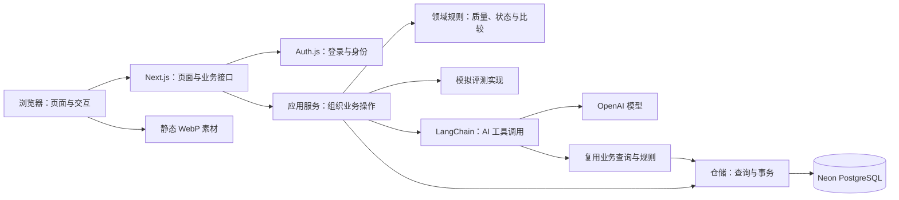

# SimEval 架构与接口文档

SimEval 的页面、业务接口和 AI 助手运行在同一个 Next.js 应用中，业务数据保存在 PostgreSQL。代码按功能和职责划分模块，部署时仍是一个应用。这种结构称为**模块化单体**：既能把代码分清楚，也便于开发、部署和维护。

本文先说明系统结构和关键流程，再列出全部现行接口，最后给出完整文件目录。接口示例使用占位 ID，不包含真实密码或密钥。

## 阅读导航

- [1. 系统由哪些部分组成](#1-系统由哪些部分组成)
- [2. 代码如何分工](#2-代码如何分工)
- [3. 数据怎样组织](#3-数据怎样组织)
- [4. 主要操作的执行过程](#4-主要操作的执行过程)
- [5. AI 助手的实现](#5-ai-助手的实现)
- [6. 权限、并发与性能](#6-权限并发与性能)
- [7. 全部 HTTP 接口](#7-全部-http-接口)
- [8. 运行配置](#8-运行配置)
- [9. 完整文件目录](#9-完整文件目录)

## 1. 系统由哪些部分组成

浏览器负责展示页面、接收操作和播放主页人物动作。Next.js 服务端负责身份验证、业务校验、查询和保存数据。AI 助手通过服务端连接 OpenAI；浏览器不能直接调用模型，也不会拿到密钥。



### 1.1 技术选择

| 技术 | 在项目中负责什么 |
|---|---|
| Next.js App Router | 页面路由、服务端页面、HTTP 接口和服务端动作 |
| React、TypeScript | 页面组件、交互状态，以及前后端共享的数据类型 |
| CSS Modules、Tailwind CSS、Lucide | 页面样式、局部样式隔离和图标 |
| Auth.js | 登录、JWT 会话、身份切换和退出 |
| Zod | 校验接口参数、配置和模型工具输入 |
| Prisma、`@prisma/adapter-pg`、`pg` | 数据模型、迁移、数据库查询和连接池 |
| PostgreSQL、Neon | 保存任务、指标、复核、聊天、报告及审计记录 |
| LangChain、`@langchain/openai` | 组织单个 Agent 的模型与工具调用循环 |
| assistant-ui | 聊天界面的运行状态、消息展示和输入适配 |
| React Markdown | 展示助手回答；不执行回答中的 HTML |
| Canvas、Pointer Events、WebP 图集 | 主页人物的鼠标、触屏与键盘交互 |
| Vitest | 既有业务规则和数据库集成测试 |
| GitHub Actions、Vercel | 持续检查、应用构建和部署 |
| Spec Kit | 保存功能规格、实现计划和任务拆分 |

依赖的具体版本以 `package-lock.json` 为准。运行环境需要 Node.js；本地开发配置和部署步骤见开发流程文档。

### 1.2 真实服务与模拟能力

身份验证、数据库读写、复核记录、报告保存和 OpenAI 聊天调用都是实际实现。评测数据、质量检查结果、任务执行、指标和日志则是合成或模拟内容。系统不连接真实机器人、不运行仿真器，也不训练模型。

评测模块通过 `EvaluationProvider` 接口接入执行实现，当前使用 `MockEvaluationProvider`。以后接真实评测服务时，可以替换这部分实现，继续使用现有的任务、结果和复核流程。真实服务还需要另外设计执行调度、失败恢复和结果校验，当前代码没有后台 Worker 或消息队列。

## 2. 代码如何分工

代码分层的目的是让一次修改有明确的位置。例如，改页面文案不需要碰数据库；调整比较规则不需要修改页面路由；增加数据库查询也不会把 SQL 写进 React 组件。

### 2.1 六个主要部分

| 位置 | 职责 | 例子 |
|---|---|---|
| `src/app/` | 定义页面和 HTTP 入口，组合功能组件 | `/evaluations/[runId]` 页面、创建任务接口 |
| `src/features/` | 表单、列表、复核编辑器、聊天和主页交互 | 创建评测的分步表单、报告列表 |
| `src/server/application/` | 组织一个完整业务操作 | 检查配置后创建任务、准备聊天上下文 |
| `src/domain/` | 写不依赖数据库的业务规则 | 什么任务能重试、哪些指标能比较 |
| `src/server/repositories/` | 读写数据库，处理事务和并发 | 原子保存任务结果、复核历史和审计 |
| `src/server/providers/`、`src/server/agent/` | 接入执行服务和模型 | 模拟评测、模型适配、只读工具 |

`src/lib/` 保存共享的数据格式、导航和客户端请求方法；`src/components/` 保存多处复用的界面组件。业务模块中的服务端文件使用 `server-only`，防止被客户端误引入。

普通业务调用顺序如下：

```text
页面组件 / HTTP 路由
  → 应用服务：这次操作要做哪些事
  → 领域规则：当前情况是否允许做
  → 仓储：读取或保存哪些数据
  → PostgreSQL
```

并非每次读取都要经过所有层。例如，报告应用服务目前直接导出报告仓储的操作。分层用于明确职责，不要求每个函数都增加一层没有实际工作的包装。

### 2.2 页面与接口的关系

工作台首屏由服务端页面读取数据，再把浏览器需要的字段交给客户端组件。用户提交表单、翻页、同步状态或保存结论时，客户端调用 HTTP 接口。登录和身份切换使用服务端动作。

服务端组件可以调用应用服务，但客户端组件不能访问 Prisma。数据库实体也不会原样传给浏览器：应用服务或仓储将日期、数值和关联对象转换成明确的数据格式，去掉密钥和内部字段。本文接口部分列出的这些格式也称为 DTO，可以理解为“前后端约定好要传哪些字段”。

### 2.3 页面入口

| 页面 | 用途 |
|---|---|
| `/` | 公开主页、项目说明、文档链接和人物交互 |
| `/login` | 输入访问密码并选择演示身份 |
| `/evaluations/new` | 配置评测并确认数据质量 |
| `/evaluations` | 查看任务、状态和待复核数量 |
| `/evaluations/{runId}` | 查看任务配置、结果、指标及后续操作 |
| `/quality` | 查看选定数据集的质量检查 |
| `/comparisons` | 查看本次指标，或与同口径历史结果比较 |
| `/anomalies` | 筛选异常样本 |
| `/anomalies/{sampleId}` | 查看证据、编辑草稿和确认结论 |
| `/reports` | 生成、查看和确认当前任务的系统报告 |

`(workspace)` 是 Next.js 的路由分组，用来共享工作台布局和登录检查，不会出现在 URL 中。工作台布局同时挂载 AI 助手，所以切换工作台页面时可以保留聊天。

`/overview` 只保留兼容跳转：有任务时进入结果页，否则进入任务列表。产品不再提供独立总览。

### 2.4 关键文件怎样配合

| 功能 | 界面 | 服务与规则 | 数据读写 |
|---|---|---|---|
| 配置与创建评测 | `features/evaluation/create-form.tsx` | `application/evaluation.ts`、`domain/evaluation.ts`、`domain/evaluation-catalog.ts` | `evaluation-repository.ts` |
| 任务状态 | `features/evaluation/task-status.tsx` | `application/evaluation.ts`、`providers/evaluation-provider.ts` | `evaluation-repository.ts` |
| 模型对比 | `features/review/comparison-view.tsx` | `application/comparison-review.ts`、`domain/comparison-review.ts` | `comparison-review-repository.ts` |
| 异常复核 | `features/review/sample-detail.tsx`、`review-editor.tsx` | `application/comparison-review.ts` | `comparison-review-repository.ts` |
| AI 聊天 | `features/assistant/conversation.tsx` | `application/assistant.ts`、`agent/agent.ts`、`agent/tools.ts` | `assistant-repository.ts`，并复用业务查询 |
| 系统报告 | `features/assistant/report-list.tsx` | `application/report.ts` | `report-repository.ts`、`evaluation-snapshot.ts` |
| 主页人物 | `features/home/interactive-home.tsx` | `home/avatar/controls.ts`、`home/avatar/engine.ts` | 不访问数据库，读取静态图集 |

表中界面和领域文件位于 `src/`，应用服务与执行实现位于 `src/server/`，仓储文件位于 `src/server/repositories/`。完整路径见文末目录。

## 3. 数据怎样组织

### 3.1 主要数据关系

一个项目有多个模型版本、数据版本和评测基准。一次评测选择其中各一个，并保存本次参数。任务成功后产生指标和异常样本。异常样本可以留下多条复核历史，但当前结论只有一份。每个成功任务最多有一份当前系统报告，也可以有多个彼此独立的私人聊天。

这里的 Benchmark 是规定“测哪些场景、用哪些指标、什么算成功”的评测基准；Episode 是一次完整的任务尝试；Seed 是用于复现模拟结果的随机种子。数据库初始化也叫 Seed，但那是填入固定演示数据的脚本，两者用途不同。

```text
Project 项目
  ├─ ModelVersion 模型版本
  ├─ DatasetVersion 数据版本 → DataQualityCheck 质量检查项
  ├─ Benchmark 评测基准 → MetricDefinition 指标定义
  └─ EvaluationRun 评测任务
       ├─ MetricResult 指标结果
       ├─ AnomalySample 异常样本 → ReviewRecord 复核历史
       ├─ AIReport 当前系统报告
       └─ AssistantSession 聊天 → AssistantTurn 一轮问答

User：操作身份                 AccessAttempt：登录失败与封锁记录
AuditLog：重要操作记录         AssistantBudget：累计 AI 费用与预留额度
```

### 3.2 表的职责

| 表 | 保存什么 | 需要注意什么 |
|---|---|---|
| `User` | 预设身份、角色、演示账号标记 | 当前只开放算法工程师和评测人员；没有个人注册 |
| `AccessAttempt` | 登录错误次数、时间窗口和封锁截止时间 | 保存经过处理的来源标识，不保存访问密码 |
| `Project` | 项目信息 | 模型、数据和基准必须属于同一项目 |
| `ModelVersion` | 模型名称、版本和引用信息 | 当前模拟参数由 `domain/evaluation-catalog.ts` 提供，不包含模型训练能力 |
| `DatasetVersion` | 数据版本、样本数和质量状态 | 当前是固定合成目录，不是上传的数据集 |
| `DataQualityCheck` | 每项检查的结果、影响数量和说明 | 例如缺失字段、标签覆盖情况 |
| `Benchmark` | 基准名称、版本、项目和指标关联 | 成功规则、兼容范围及 Episode 限制由领域目录提供 |
| `MetricDefinition` | 指标名称、单位和好坏方向 | 成功率越高越好，碰撞率越低越好 |
| `EvaluationRun` | 参数、配置快照、创建者、状态、基线和重试来源 | 每次重试产生新任务；删除为软删除 |
| `MetricResult` | 某任务、指标、场景的值和样本数 | 指标值与统计分母一起保存 |
| `AnomalySample` | 异常证据、草稿、最终结论、编辑版本 | 日志和媒体路径是证据入口 |
| `ReviewRecord` | 每次保存或确认的内容、操作者及版本变化 | 追加历史，便于追溯 |
| `AIReport` | 当前系统报告正文、来源指纹及确认状态 | 沿用历史表名；当前报告由代码模板生成 |
| `AuditLog` | 重要操作的对象、操作者、请求标识和时间 | 记录状态变化及报告更新前的内容 |
| `AssistantSession` | 聊天绑定的任务、可选基线及登录归属 | 同一任务可以有不同访客的独立聊天 |
| `AssistantTurn` | 一轮问题、回答、工具记录、证据和用量 | 不等同于一份系统报告 |
| `AssistantBudget` | 累计费用估算、进行中预留额度 | 持久化保存，服务重启不清零 |

Schema 中还保留 `BackfillTask` 及少量旧枚举，供历史数据兼容。当前没有独立回补任务、样本分配或重新打开复核的操作入口，不能据此把它们视为已开放功能。

### 3.3 数据库约束与索引

外键用于保证关联对象存在，唯一约束用于阻止重复业务记录。例如，指标结果按“任务＋指标定义＋场景”唯一；样本按“任务＋样本编号”唯一；聊天轮次按“会话＋请求键”唯一。

报告表的 `currentForRunId` 可为空，但非空时必须等于该记录的 `runId`，且不能重复。因此，一个任务在数据库中至多有一条当前报告。历史重复记录可以保留，但不进入当前报告列表。

任务名称另由事务保护：同项目未隐藏的任务去掉名称两端空格后，忽略大小写判重。它不是简单的 `name` 唯一索引，因为软删除后允许复用名称。创建时锁定项目记录，再判断名称是否占用。

列表相关索引覆盖项目、状态、创建者、隐藏标记和时间；复核与聊天也按各自的任务、会话和状态建立索引。具体定义统一维护在 `prisma/schema.prisma` 和迁移 SQL 中。

### 3.4 配置快照、版本号与来源指纹

**配置快照**记录任务创建时使用的参数和模拟规则。它让旧任务保留当时的含义，避免目录配置调整后，历史结果被重新解释成另一种设置。

**编辑版本 `version`**用于防止两个人覆盖彼此的复核内容。页面读到版本 3，保存时就提交 `expectedVersion: 3`。如果数据库已变成版本 4，服务端返回冲突，要求先读取最新内容。`confirmedRevision` 则记录最终结论文本的修订，与编辑次数分开。

**来源指纹 `sourceHash`**是把任务、指标和样本状态组成快照后计算出的 SHA-256 摘要。报告确认前会比较这个摘要，判断页面看到的内容是否仍然对应当前证据。摘要不是加密，也不是完整备份。

来源快照包含样本编辑版本，因此保存草稿也可能让旧报告或旧聊天显示“来源已变化”。是否过时按完整快照判断，不能只看最终结论有没有改字。

## 4. 主要操作的执行过程

### 4.1 创建评测

创建表单先读取模型、数据、基准和可选基线。用户填写任务名称、Episode 数、Seed 等参数，查看质量检查后提交。

服务端按以下顺序处理：

1. 验证会话、工程师角色、同源请求和参数格式。
2. 开始事务并锁定账号，检查幂等键。相同请求已经成功创建时，直接返回原任务。
3. 读取模型、数据、基准和可选基线，检查当前质量状态。`PASSED` 可继续，`WARNING` 必须明确接受，`FAILED` 阻止创建。
4. 检查这些配置是否同属一个项目、彼此兼容，以及基线和 Episode 范围是否符合要求。
5. 锁定项目，检查任务名是否重复；重试时分配未占用的编号。
6. 检查该工程师是否已有 3 个进行中任务。
7. 保存 `QUEUED` 任务、配置快照和审计记录，提交事务。

幂等的意思是：同一次提交因为重试而到达两次，也只创建一个任务。它与名称判重解决不同问题。名称判重处理“两个不同提交使用同一个名字”，幂等处理“同一个提交重复到达”。

### 4.2 模拟任务怎样完成

浏览器对进行中任务每隔约 1.5 秒调用同步接口。模拟实现按服务器时间推进：创建满 1 秒，可以从 `QUEUED` 进入 `RUNNING`；创建满 4 秒，可以从 `RUNNING` 进入 `SUCCEEDED` 或 `FAILED`。每次同步最多推进一段状态，所以第一次同步即使已超过 4 秒，也先进入 `RUNNING`。

状态查询只读取结果，不推进执行。当前没有后台进程持续跑任务，关闭所有相关页面后，也就没有浏览器继续发起同步请求。

```text
QUEUED 排队 → RUNNING 运行 → SUCCEEDED 成功
                         └→ FAILED 失败
QUEUED / RUNNING → CANCELLED 取消
FAILED → 创建新的重试任务，原失败任务保留
```

成功时，仓储在同一个事务中保存指标、异常样本、终态和审计记录，避免页面看到“任务成功了，但结果只写了一半”。合成指标由配置、Seed 和 Episode 数确定，不根据用户选的基线或目标成功率倒推结果。

取消只允许工程师操作本人创建的非固定任务。如果任务已被另一个请求完成，取消返回状态冲突。重试也只允许本人失败的非固定任务，名称自动使用未占用的“原名 · 重试 N”。

### 4.3 模型对比

对比先确认两边均成功，且项目、数据版本、基准、Episode 和 Seed 相同，模型版本不同。比较时使用指标键和场景键匹配，再核对单位、好坏方向及样本数。

这些条件不一致时，系统显示“不可比较”，不强行计算差值。百分比指标的差使用百分点 `pp`：81% 与 76% 相差 5 个百分点，而不是相对提高 5%。

比较差值和好坏判断由后端规则计算。AI 助手可以解释计算结果，但不负责重新算出另一套结果。基线选择只是本次查看条件，不会修改已经创建的任务。

### 4.4 人工复核

样本详情页展示日志、关联指标、当前草稿、已确认结论和历史。算法工程师只能保存本人任务的草稿；评测人员可以编辑草稿并确认最终结论。

保存请求携带 `expectedVersion`。仓储锁定所属任务，核对版本，在一个事务中更新样本、追加复核历史并记录审计。每次成功保存都增加编辑版本；最终结论文本发生变化时，才增加确认修订号。

确认后，样本状态变为 `RESOLVED`，草稿被清空。已确认样本如果又有新草稿，仍会被计入待复核。版本冲突时界面保留输入，避免用户刚写的内容丢失。

### 4.5 系统报告

报告页从当前任务指标和人工确认结论生成固定格式报告，不调用大模型，也不包含草稿文本或访客私聊。没有最终结论的样本显示“尚无人工确认结论”，报告同时说明数据和执行为模拟。

生成时锁定任务并读取来源快照。如果已有当前报告且来源未变，返回原报告，保留确认状态。如果来源变化，更新同一条报告、清除旧确认，并把更新前内容保存到审计记录。

评测人员确认报告时提交页面所见的 `expectedSourceHash`。服务端同时核对报告版本和当前证据。这样可以避免一人在旧页面点击确认时，另一人刚刚更新了结论。每个任务只有一份当前报告，AI 聊天只做调查与解释。

## 5. AI 助手的实现

### 5.1 从问题到回答

AI 助手是一个有工具的聊天 Agent。它可以根据问题决定先查哪些数据，再依据返回的证据回答。当前是单个 Agent，没有多 Agent 协作或独立 Agent 服务。

```text
访客输入问题
  → 前端发送本轮问题、请求键和可选样本提示
  → 服务端核对聊天归属、任务、权限和预算
  → 读取最近 3 轮成功问答
  → LangChain 调用模型
  → 模型按需调用只读工具
  → 工具查询当前任务的数据，返回证据
  → 模型生成带证据编号的回答
  → 校验引用，保存回答、证据、调用记录和用量
```

`features/assistant/conversation.tsx` 使用 assistant-ui 的本地运行时适配现有后端。浏览器不把自己拼出的历史、角色或工具结果当作可信数据发送。服务端从数据库取历史，并把会话对应的账号、登录标识、任务和基线绑定到工具中。

模型适配集中于 `server/agent/model.ts`，当前使用 OpenAI 的 Chat Completions 接口和 `gpt-5.4-mini`。`agent.ts` 负责提示词、工具循环、流式输出和停止条件；`application/assistant.ts` 负责登录归属、请求登记、保存和费用结算。

### 5.2 四个只读工具

| 工具 | 查什么 | 权限和范围 |
|---|---|---|
| `getEvaluationSummary` | 当前任务配置、指标及待复核情况 | 两种角色可用，任务由会话绑定 |
| `compareEvaluationMetrics` | 当前任务与已选基线的比较 | 仅算法工程师可用；需要有效基线 |
| `listAnomalySamples` | 按场景、指标或待复核状态查异常 | 两种角色可用，分页返回当前任务样本 |
| `getAnomalyEvidence` | 一个样本的日志、草稿和最终结论 | 两种角色可用，必须属于当前任务 |

评测人员可用其中三个工具，不提供比较工具。工具不能修改复核、取消任务或生成报告。AI 也不能自己选择另一个项目的任务绕过会话范围。

工具复用现有应用服务和仓储，没有另外维护一套指标算法。单轮内相同查询可以复用工具结果，并在调用记录中说明；单个结果限制大小，指标、列表和日志也分别限制返回数量或长度。

### 5.3 证据和引用

成功的工具读取会生成 `E1`、`E2` 等本轮证据编号。回答中的 `[E1]` 对应服务端保存的证据卡片，卡片记录标题、摘要、来源页面和采集时间。界面还会展示实际调用了哪个工具、耗时和结果状态。

保存前会检查引用编号是否属于本轮，有证据时要求回答引用证据。这能发现不存在的引用，但不能代替逐句事实核验；模型的分析仍需要人工判断。

证据链接由服务端构建。回答中的 HTML 不执行，图片不加载，模型写出的任意链接不作为可信的业务跳转。旧聊天恢复时会比较来源指纹，来源变化则提示回答可能已经过时。

### 5.4 上下文和聊天隔离

业务数据由演示身份共享，但聊天按“账号＋本次登录的 `accessId`”隔离。同样选择算法工程师的两个访客，也不会因此看到彼此的聊天。重新登录或切换身份后会产生新的访问标识。

聊天历史保存在 PostgreSQL，每轮开始读取最近 3 轮成功问答；模型循环还包含本轮问题和工具查询结果，当前证据需要重新读取。这是有限的对话上下文，不是长期记忆。历史保存也不代表刷新后可以从中断位置继续执行 Agent。

在工作台换页面时，已有聊天继续绑定原任务；“分析本页”用于按新任务建立聊天。收起面板不等于停止生成，“停止”才发起取消请求。读取会话详情时，服务端也会把超过截止时间的运行轮次记为超时。

### 5.5 运行和费用限制

| 限制 | 当前值 | 作用 |
|---|---|---|
| 单轮总时间 | 60 秒 | 防止工具循环一直运行 |
| 单轮模型调用 | 最多 6 次 | 限制反复思考和调用 |
| 单轮工具调用 | 最多 8 次 | 限制反复查询 |
| 输出长度配置 | `maxOutputTokens: 1800` | 限制模型单次输出 |
| 输入消息大小 | 40,000 字节 | 限制送入循环的消息；这是字节上限，不是 token 数 |
| 历史上下文 | 最近 3 轮成功问答 | 控制上下文长度 |
| 每会话 | 最多 16 轮 | 防止一个聊天无限增长 |
| 每次登录 | 同时 1 轮、每小时最多 12 轮、最多 40 个会话 | 限制单个访客占用 |
| 全局生成并发 | 最多 3 轮 | 保护服务和共享预算 |
| 累计预算 | `ASSISTANT_BUDGET_USD`，默认 3 美元 | 在数据库中持续累计 |

每轮开始前会在数据库中预留额度，当前预留值为 0.40 美元。这是项目代码按模型和运行上限计算的保守估算，不代表每轮实际收费。已返回用量按代码配置结算；无法取得用量时保留预留额度。停止生成也不保证模型平台退费。

费用计算和允许的模型集中在 `server/agent/config.ts`。更换模型时需要一起核对费用估算，不能只修改模型名称。数据库登记与结算使用事务，模型网络请求发生在事务之外，不长时间占用数据库锁。

### 5.6 为什么没有 RAG 和向量数据库

RAG 是先检索资料，再把找到的内容交给模型回答。助手当前查询的是结构清楚的任务、指标和样本，现有数据库查询已经能准确找到它们，因此采用只读工具，没有加入文档切块或向量检索。开场问题和回答后的快捷追问由本地模板生成，点击后只填入输入框，用户确认发送才调用模型。

## 6. 权限、并发与性能

### 6.1 身份与请求边界

访问密码只在服务端读取，用于进入两种预设身份，不写入数据库。密码校验使用摘要和固定时间比较。Auth.js 签发最长 12 小时的 JWT 会话，Cookie 在 HTTPS 下使用安全标记。

工作台页面和业务接口仍从数据库核对账号与角色，不只相信浏览器传来的身份。写请求必须来自当前站点，带 JSON 正文的请求还要通过格式和 Zod 校验。仅隐藏按钮不能代替服务端权限检查。

访问失败限制保存在数据库：15 分钟窗口内 5 次错误会触发 15 分钟封锁，因此部署多个应用实例后也能共享限制。来源标识经过 HMAC 处理，错误响应不暴露密钥、连接地址、SQL 或堆栈。

### 6.2 并发保护分别解决什么问题

| 机制 | 解决的问题 | 项目中的使用位置 |
|---|---|---|
| 幂等键 | 重复提交产生两个任务或两次模型调用 | 创建、重试、聊天发消息 |
| 事务 | 几项相关写入只成功一部分 | 任务完成、复核、报告更新、预算登记 |
| 行锁 | 两个请求同时检查时都认为还能操作 | 活跃任务数量、任务名称、复核、报告 |
| 条件更新 | 状态已被别人改变，仍按旧状态操作 | 取消、状态推进、聊天停止 |
| 编辑版本 | 后保存的人覆盖前一个人的结论 | 样本复核 |
| 来源指纹 | 根据旧指标或旧结论确认报告 | 系统报告、旧聊天过时提示 |

创建和重试使用可串行化事务，并对事务竞争做有限重试。其他操作按规则锁定任务或预算记录，会话创建还按登录标识串行处理。并发保护位于服务端，即使有人绕过页面直接发请求，仍会受到限制。

行锁会在事务完成前锁住相关记录，让另一个修改它的请求等待。可串行化事务则要求并发操作的结果符合依次执行时的规则；数据库发现冲突时，当前操作回滚，再按设定次数重试。

任务软删除只隐藏普通列表与详情，不物理删除历史关系。固定示例不能删除。已绑定的基线引用可以保留，但隐藏任务不再作为新基线选项。当前同步入口对隐藏终态仍可返回状态，不会重新启动它。

### 6.3 工作台读取

数据库客户端在同一进程中复用，连接池最多 5 条连接，空闲 60 秒后释放，连接等待上限 10 秒。这可以减少切换页面时重复建立连接，但不会消除跨地区网络延迟或数据库冷启动。

任务列表只取展示所需的摘要，待复核数量在数据库中统计，不把全部指标、日志和草稿带到列表。基线下拉只取 ID、任务名和模型版本；选中后再读取完整结果。服务端页面内的请求缓存用于合并同一次渲染的重复查询，不是跨访客共享的永久缓存。

业务 HTTP 响应使用 `Cache-Control: no-store`，避免浏览器把私人聊天或变动中的业务数据当作长期缓存。独立读取可以并行，相关写入仍由事务保证一致。

### 6.4 主页人物和助手小人

主页效果使用四段动作的序列帧，浏览器并不实时渲染 3D 模型。四个方向共用待机姿势，切换方向时先沿原动作回到待机，再进入新动作，避免不同姿势直接硬切。

正式素材在 `public/avatar/v1/`：四向各 56 帧，每张 WebP 图集放 2×2 帧，另有待机图和清单。浏览器先完成全部素材下载及解码检查，再显示完整主页；等待较久时显示实际进度，失败时提供重试和静态展示。播放时只保留有限数量的解码位图，组件卸载后释放资源。

鼠标位置决定方向和动作进度，顶部、底部优先控制抬头、低头；触屏以手指按下的位置为起点，用独立参数调灵敏度。`controls.ts` 管这些规则，`engine.ts` 管图集读取、帧推进和画面绘制。样式和文字分别放在 `home.module.css`、`content.ts`。

版本化图集使用一年不可变缓存。更新素材要换版本目录，并同时修改素材地址和缓存规则。助手 Q 版头像则是小尺寸透明 WebP，起伏、倾斜和弹跳由 CSS 完成；聊天面板首次点击后才加载，不把主页图集带入每个工作台页面。

## 7. 全部 HTTP 接口

当前共有 **23 项业务操作**。下文完整列出请求字段、返回格式和主要限制；OpenAPI 文件用于机器读取，本文可以独立阅读。

角色缩写：`E` 为算法工程师，`R` 为评测人员。除创建和重试的首次成功返回 201 外，其余成功均返回 200。接口使用已有登录 Cookie，不提供单独的 Bearer Token 登录方式。

### 7.1 通用约定

| 项目 | 约定 |
|---|---|
| ID | 去两端空格后 1–64 个字符，只接受字母、数字、下划线和连字符 |
| 分页 | `page` 从 1 开始；`pageSize` 默认 20、最大 100；任务选择界面每页 6 条是界面设置 |
| 写请求 | POST、PATCH、DELETE 要带当前站点的 `Origin` |
| JSON 正文 | 有正文的操作使用 `Content-Type: application/json`；无正文操作不要求伪造空 JSON |
| 幂等请求头 | `Idempotency-Key` 去两端空格后 1–128 个字符；创建、重试必填 |
| 时间 | 返回 ISO 格式字符串；没有发生的时间为 `null` |
| 未知字段 | 使用严格 Zod Schema 的请求拒绝未知字段；无参数 GET 和报告列表等入口不作统一承诺 |

普通成功响应：

```json
{
  "data": { "id": "run_example" },
  "meta": { "requestId": "request_example" }
}
```

分页成功响应的 `data` 为数组：

```json
{
  "data": [],
  "meta": { "page": 1, "pageSize": 20, "total": 0, "requestId": "request_example" }
}
```

错误响应：

```json
{
  "error": {
    "code": "RUN_NAME_CONFLICT",
    "message": "已存在同名任务，请换一个任务名称",
    "fieldErrors": { "name": ["已存在同名任务，请换一个任务名称"] },
    "requestId": "request_example"
  }
}
```

`fieldErrors` 没有字段级错误时为 `null`。客户端按 `code` 判断错误类型，按 `message` 展示说明；`requestId` 用于对应服务端日志。聊天生成的流式响应另见 7.6。

### 7.2 目录与质量：2 项

| 方法与路径 | 角色 | 请求 | `data` 返回 |
|---|---|---|---|
| GET `/api/evaluation-catalog` | E/R | 无业务参数 | `EvaluationOptions` |
| GET `/api/datasets/{datasetId}/quality` | E/R | 路径数据集 ID | `QualityData` |

`EvaluationOptions` 字段：

| 字段 | 内容 |
|---|---|
| `project` | `{id, name}`，不存在时为 `null` |
| `models` | `{id, name, version}[]` |
| `datasets` | `QualityData[]`，包含各数据集的质量检查 |
| `benchmarks` | `{id, name, version, successRule, datasetIds, modelIds, minEpisodes, maxEpisodes}[]` |
| `baselines` | 可选基线的完整 `Run[]` |
| `recent` | 近期任务的完整 `Run[]` |
| `activeTaskLimit` | 当前为 3 |

`QualityData` 字段：

| 字段 | 内容 |
|---|---|
| `dataset` | `{id, name, version, sampleCount, qualityStatus}` |
| `checks` | `{key, name, status, affectedCount, message}[]` |
| `canStartEvaluation` | 是否未被失败质量状态阻止；警告仍需另行接受 |

`qualityStatus` 和检查项 `status` 均为 `PASSED`、`WARNING`、`FAILED` 之一。检查结果由演示数据提供，查询接口不执行真实扫描。

### 7.3 评测任务：8 项

| 方法与路径 | 角色 | 请求 | `data` 返回 |
|---|---|---|---|
| GET `/api/evaluation-runs` | E/R | 可选 `page`、`pageSize`、`status`、`projectId` | `RunSummary[]`，附分页信息 |
| POST `/api/evaluation-runs` | E | 创建正文＋`Idempotency-Key` | 新 `Run`；首次 201，重放 200 |
| GET `/api/evaluation-runs/{runId}` | E/R | 路径任务 ID | 完整 `Run` |
| GET `/api/evaluation-runs/{runId}/status` | E/R | 路径任务 ID | `RunStatusData`；只读 |
| POST `/api/evaluation-runs/{runId}/sync` | E/R | 无正文 | `RunStatusData`；推进一段模拟状态 |
| POST `/api/evaluation-runs/{runId}/cancel` | E | 本人非固定排队／运行任务；无正文 | 取消后的完整 `Run` |
| POST `/api/evaluation-runs/{runId}/retry` | E | 本人非固定失败任务；无正文，带幂等键 | 新 `Run`；首次 201，重放 200 |
| DELETE `/api/evaluation-runs/{runId}` | E | 本人非固定终态任务；无正文 | `{id, deletedAt}`；重复删除仍为 200 |

创建正文：

| 字段 | 必填 | 规则 |
|---|---|---|
| `name` | 是 | 去两端空格后 1–120 个字符；同项目可见任务不可重名，忽略大小写 |
| `modelVersionId` | 是 | 有效模型版本 ID |
| `datasetVersionId` | 是 | 有效数据版本 ID |
| `benchmarkId` | 是 | 有效评测基准 ID |
| `episodeCount` | 是 | 整数 1–10000；目录兼容规则会进一步缩小允许范围 |
| `simulationSeed` | 是 | 整数 0–2147483647 |
| `acceptQualityWarning` | 是 | 布尔值；警告数据必须传 `true` |
| `baselineRunId` | 否 | 成功的同口径基线 ID，或 `null` |
| `targetSuccessRate` | 否 | `0.8`、`0.85` 或 `null`，不影响模拟结果生成 |
| `mockFailure` | 否 | 布尔值，默认 `false`；用于模拟失败 |

创建请求示例：

```http
POST /api/evaluation-runs
Origin: https://your-site.example
Content-Type: application/json
Idempotency-Key: create-example-001
```

```json
{
  "name": "仓库场景版本评测",
  "modelVersionId": "model_candidate",
  "datasetVersionId": "dataset_scenes",
  "benchmarkId": "benchmark_warehouse",
  "episodeCount": 200,
  "simulationSeed": 20260901,
  "acceptQualityWarning": true,
  "baselineRunId": null,
  "targetSuccessRate": 0.8,
  "mockFailure": false
}
```

同一账号、同一操作、同一幂等键和相同请求返回原任务；同键不同内容返回 409。重试使用新的操作范围，重新校验配置和质量，关闭模拟失败，并自动分配不重名的重试名称。

`RunSummary` 只有这些字段：

```text
id, name, projectId, status, baselineRunId, createdAt,
modelName, modelVersion, datasetName, datasetVersion,
createdById, isDemoFixture, pendingReviewCount
```

完整 `Run` 在上述字段外增加：

| 字段 | 内容 |
|---|---|
| `modelVersionId`、`datasetVersionId`、`benchmarkId` | 选用的配置 ID |
| `benchmarkName`、`benchmarkVersion`、`successRule` | 基准显示信息和成功判定规则 |
| `retryOfRunId` | 重试来源；普通任务为 `null` |
| `episodeCount`、`simulationSeed`、`targetSuccessRate` | 本次执行参数；目标可空 |
| `provider` | 执行实现标识，当前为模拟实现 |
| `startedAt`、`finishedAt` | 起止时间，可空 |
| `errorCode`、`errorMessage` | 失败信息，可空 |
| `anomalyCount` | 异常样本数量 |
| `metrics` | `{key, name, unit, scenarioKey, value, sampleCount}[]` |

任务 `status` 为 `QUEUED`、`RUNNING`、`SUCCEEDED`、`FAILED`、`CANCELLED`。`metrics.value` 是数值，不是格式化后的字符串；完整任务中的指标不含 `direction`，方向会在比较指标中返回。

`RunStatusData` 示例：

```json
{
  "runId": "run_example",
  "status": "RUNNING",
  "progress": null,
  "startedAt": "2026-10-05T02:00:01.000Z",
  "finishedAt": null,
  "pollAfterMs": 1500
}
```

`progress` 只有成功时为 1，其他状态为 `null`，不展示虚构的运行百分比。进行中 `pollAfterMs` 为 1500，终态为 0。取消遇到已完成等竞争情况返回 409；删除只隐藏记录，不删除已保存的历史引用。

### 7.4 模型对比：1 项

| 方法与路径 | 角色 | 请求 | `data` 返回 |
|---|---|---|---|
| GET `/api/comparisons` | E | 必填 `candidateRunId`；可选 `baselineRunId`、`scenarioKey` | `ComparisonData` |

不传基线时返回本次指标，`baseline` 为 `null`。`scenarioKey` 去两端空格后长度为 1–120。总体场景在接口中使用实际场景键 `__overall__`。

`ComparisonData`：

| 字段 | 内容 |
|---|---|
| `candidate` | 当前任务的完整 `Run` |
| `baseline` | 选中基线的完整 `Run`，或 `null` |
| `baselines` | 可选基线摘要 `{id, name, modelVersion}[]` |
| `metrics` | 比较指标数组，格式如下 |
| `anomalyCount`、`pendingReviewCount` | 当前任务的异常总数和待复核数 |

每条比较指标：

| 字段 | 内容 |
|---|---|
| `key`、`name`、`unit`、`scenarioKey` | 指标和场景信息 |
| `direction` | `HIGHER_IS_BETTER` 或 `LOWER_IS_BETTER` |
| `candidateValue`、`baselineValue` | 两边的指标值，缺失为 `null` |
| `candidateSampleCount`、`baselineSampleCount` | 两边的统计样本数，缺失为 `null` |
| `delta`、`deltaUnit` | 当前减基线的差值和单位；百分比差用 `pp`；不可比较时差值为 `null` |
| `verdict` | `IMPROVEMENT`、`REGRESSION`、`UNCHANGED`、`NOT_COMPARABLE` 或 `CURRENT_ONLY` |
| `reason` | 不可比较的原因，其他情况可空 |
| `evidenceCount` | 当前任务中关联该指标和场景的异常数 |

请求示例：`GET /api/comparisons?candidateRunId=run_candidate&baselineRunId=run_baseline&scenarioKey=occlusion`。

### 7.5 异常样本与复核：3 项

| 方法与路径 | 角色 | 请求 | `data` 返回 |
|---|---|---|---|
| GET `/api/anomaly-samples` | E/R | 必填 `runId`；筛选及分页见下表 | `Sample[]`，附分页信息 |
| GET `/api/anomaly-samples/{sampleId}` | E/R | 可选 query `runId`，用于核对父任务 | `SampleDetail` |
| PATCH `/api/anomaly-samples/{sampleId}/review` | E/R | `{conclusion, mode, expectedVersion}` | 保存后的 `SampleDetail` |

异常列表参数：

| 参数 | 规则 |
|---|---|
| `runId` | 必填，成功且可见的任务 |
| `metricKey`、`scenarioKey` | 可选，去两端空格后 1–120 个字符 |
| `status` | 可选：`OPEN`、`IN_REVIEW`、`RESOLVED`、`REOPENED` |
| `reviewState` | 可选：`pending` 或 `confirmed` |
| `page`、`pageSize` | 使用通用分页规则 |

部分状态为历史兼容值，列表可筛选，不代表存在分配或重新打开接口。HTTP 列表只返回样本数组及分页信息；应用内部的列表数据还包括任务和筛选项，两者不要混用。

`Sample` 字段：

| 字段 | 内容 |
|---|---|
| `id`、`runId`、`sampleNumber` | 样本 ID、所属任务、展示编号 |
| `scenarioKey`、`metricKey`、`anomalyType` | 场景、指标和异常类型 |
| `status`、`version`、`pendingReview` | 状态、编辑版本、是否待复核 |
| `title`、`logExcerpt`、`mediaPath` | 标题、日志和媒体路径；后两者可空 |
| `conclusion`、`draftConclusion` | 已确认结论和草稿，可空 |
| `draftUpdatedBy`、`draftUpdatedAt` | 草稿作者 `{id, name}` 和时间，可空 |
| `confirmedBy`、`confirmedAt` | 确认人 `{id, name}` 和时间，可空 |
| `confirmedRevision` | 最终结论的修订号 |

`SampleDetail` 为 `{sample, run, history, staleReportCount}`。`run` 为完整任务，`history` 每项包含 `id, mode, conclusion, actor, createdAt, fromVersion, toVersion, confirmedRevision`；`actor` 为 `{id, name, role}`，版本和修订信息可空。`staleReportCount` 为过时报告计数。

复核正文：`conclusion` 去两端空格后 1–4000 个字符；`mode` 为 `draft` 或 `confirm`；`expectedVersion` 为至少 1 的整数。工程师只允许本人任务的 `draft`，评测人员可使用两种模式。

```json
{
  "conclusion": "日志显示遮挡期间发生碰撞，需要结合该场景进一步核查。",
  "mode": "confirm",
  "expectedVersion": 3
}
```

版本已变化时返回 409 `VERSION_CONFLICT`，客户端应读取最新详情后再处理，不能自动覆盖。

### 7.6 AI 聊天：5 项

| 方法与路径 | 角色 | 请求 | 返回 |
|---|---|---|---|
| GET `/api/assistant/sessions` | E/R | 无业务参数 | 当前登录的 `Session[]`，按更新时间倒序，最多 40 条 |
| POST `/api/assistant/sessions` | E/R | `{runId, baselineRunId?}` | 新 `Session`，200；每次调用新建，不做幂等复用 |
| GET `/api/assistant/sessions/{sessionId}` | E/R | 路径会话 ID | `{session, turns}`，最多 16 轮 |
| POST `/api/assistant/sessions/{sessionId}/messages` | E/R | `{question, requestKey, sampleId?}` | NDJSON 事件流 |
| POST `/api/assistant/sessions/{sessionId}/turns/{turnId}/stop` | E/R | 无正文 | `{stopped: true}` |

全部聊天操作都要求会话属于当前账号和本次登录。创建会话的任务必须成功；`baselineRunId` 可空、默认 `null`，仅工程师可绑定基线。达到 40 个会话时返回 `SESSION_LIMIT`。

`Session`：

```text
id, title, runId, runName, baselineRunId, baselineName, updatedAt
```

`baselineRunId` 和 `baselineName` 可空。`Turn` 字段：

| 字段 | 内容 |
|---|---|
| `id`、`requestKey` | 轮次 ID 和本轮 UUID 请求键 |
| `question`、`answer` | 问题和回答；没有完成回答时 `answer` 可空 |
| `status`、`errorMessage` | 运行状态和错误说明；错误说明可空 |
| `evidence`、`traces` | 保存的证据和工具调用记录 |
| `createdAt`、`model` | 创建时间和使用的模型 |
| `inputTokens`、`outputTokens` | 已知用量，无法取得时为 `null` |
| `stale` | 保存回答的来源是否已变化 |

证据格式为 `{id, title, href, kind, summary, capturedAt, snapshot?}`，`kind` 为 `summary`、`comparison`、`samples`、`sample`。工具记录格式为 `{id, tool, label, input, status, durationMs, summary}`，其中 `input` 为 JSON 字符串，记录状态为 `running`、`success`、`error`。

发消息正文：

```json
{
  "question": "这次评测有哪些值得关注的变化？",
  "requestKey": "c238094f-7c28-48c3-93d9-2f7320b65e85",
  "sampleId": null
}
```

`question` 去两端空格后 1–2000 个字符；`requestKey` 必须为 UUID；`sampleId` 可空，默认 `null`，用于提示当前关注的样本，仍需核对它属于本任务。相同会话和请求键重复到达时，返回已有轮次，不再次调用模型。

#### 流式响应

发消息成功建立流后使用 `Content-Type: application/x-ndjson`，每行是一个 JSON 对象。它不是普通的 `data/meta` 响应，也不是 SSE 或 WebSocket。

| 事件 | 格式 | 客户端处理 |
|---|---|---|
| 开始 | `{type: "start", turnId}` | 保存本轮 ID |
| 工具记录 | `{type: "trace", trace}` | 更新工具调用状态 |
| 回答片段 | `{type: "text", delta}` | 追加文字 |
| 结束 | `{type: "done", turn}` | 以最终保存的轮次为准，检查 `turn.status` |
| 保存异常 | `{type: "error", code, message}` | 显示无法保存等错误 |

以下展示开始和文字事件，工具与完整轮次字段按上表返回：

```text
{"type":"start","turnId":"turn_example"}
{"type":"text","delta":"总体成功率有所上升，但遮挡场景仍需关注。[E1]"}
```

`done` 中包含完整 `Turn`，不是只有一段回答。成功轮次为 `SUCCEEDED`；失败、取消和超时为 `FAILED`、`CANCELLED`、`TIMED_OUT`。幂等重放可能直接返回 `done`，不重新产生文字片段。

流建立前的参数、权限、预算或服务配置错误仍返回普通错误 JSON。流建立后 HTTP 可能已经是 200，但本轮生成仍可能失败，所以不能只看 HTTP 状态码。保存故障使用 `SAVE_FAILED` 事件。停止为尽力取消，已结束的状态不会被晚到的成功结果覆盖。

模型循环中的上下文过长、调用次数达到上限、引用不合法或模型错误，会以失败轮次和 `errorMessage` 返回，不能当作普通 HTTP 错误处理。轮次的内部错误代码保存在数据库，不是 `Turn` 的公开字段。

### 7.7 系统报告：4 项

路径沿用 `/api/ai-reports`，但当前报告是系统模板报告，不由 AI 聊天生成。

| 方法与路径 | 角色 | 请求 | `data` 返回 |
|---|---|---|---|
| GET `/api/ai-reports` | E/R | 必填 query `runId` | `[]` 或 `[Report]`，最多一份当前报告 |
| POST `/api/ai-reports` | E/R | `{runId}` | 生成、复用或更新后的 `Report` |
| GET `/api/ai-reports/{reportId}` | E/R | 路径报告 ID | 当前 `Report`；旧重复报告不提供详情 |
| POST `/api/ai-reports/{reportId}/confirm` | R | `{expectedSourceHash}` | 确认后的 `Report` |

任务必须成功且未隐藏。没有生成报告时，列表为空。生成时来源未变则复用，变化则更新同一 ID 并恢复 `READY`。

`Report` 字段：

| 字段 | 内容 |
|---|---|
| `id`、`runId` | 报告 ID 和所属任务 |
| `status`、`isStale` | 当前状态和来源是否过时 |
| `createdAt`、`updatedAt` | 首次生成和最近更新时间 |
| `sourceHash` | 本报告对应的来源摘要 |
| `confirmedAt` | 确认时间，未确认为 `null` |
| `model` | 当前固定为 `null` |
| `output` | 报告正文，格式见下表 |

`output`：

| 字段 | 内容 |
|---|---|
| `version` | 当前为 1 |
| `title`、`summary` | 标题和摘要 |
| `metrics` | `{name, scenario, value, unit}[]` |
| `findings` | `{sampleId, label, conclusion, confirmed}[]`，区分人工确认状态 |
| `limitations` | 范围和限制说明 `string[]` |

确认正文中的 `expectedSourceHash` 必须是页面读到的 64 位小写十六进制摘要。报告已更新时返回 409 `VERSION_CONFLICT`；当前证据变化时返回 409 `SOURCE_CHANGED`。重复确认已确认且来源未变的报告会返回原记录。

### 7.8 错误处理

下表列出接口调用时需要处理的主要错误。流式回答中的失败状态和普通 HTTP 错误分开处理。

| HTTP | 代码或类型 | 含义与处理 |
|---|---|---|
| 401 | `UNAUTHENTICATED` | 会话无效或缺少登录访问标识，重新进入工作台 |
| 403 | `FORBIDDEN` | 角色、归属或同源检查不通过 |
| 404 | `NOT_FOUND` | 对象不存在、已隐藏或不属于可访问范围 |
| 409 | `RUN_NAME_CONFLICT` | 名称被占用，修改任务名 |
| 409 | `IDEMPOTENCY_CONFLICT` | 同一幂等键对应不同请求 |
| 409 | `TASK_LIMIT_REACHED` | 已有 3 个进行中任务，先等待或取消 |
| 409 | `RUN_IN_PROGRESS` | 本次登录已有问题在分析，先等待或停止 |
| 409 | `CONTEXT_LIMIT` | 会话已达到 16 轮，另建会话 |
| 409 | `STATE_CONFLICT` | 当前状态不允许相应操作 |
| 409 | `VERSION_CONFLICT` | 复核版本或页面报告版本已变化，读取最新内容 |
| 409 | `SOURCE_CHANGED` | 报告证据已变化，先更新报告 |
| 422 | `VALIDATION_ERROR` | JSON、字段、ID 或参数格式不正确 |
| 422 | `INCOMPATIBLE_CONFIGURATION` | 模型、数据、基准或比较条件不兼容 |
| 422 | `DATASET_QUALITY_BLOCKED` | 数据质量失败，不能创建评测 |
| 422 | `QUALITY_WARNING_NOT_ACCEPTED` | 尚未明确接受质量警告 |
| 413 | `VALIDATION_ERROR` | 助手请求正文过大 |
| 429 | `SESSION_LIMIT`、`RATE_LIMITED`、`BUDGET_EXHAUSTED` | 会话数、频率、并发或累计预算达到限制 |
| 503 | `MODEL_CONFIG`、`MODEL_UNAVAILABLE` 等 | 模型配置或服务暂时不可用 |
| 500 | `INTERNAL_ERROR` | 未预期的服务错误，通过请求标识查日志 |

### 7.9 Auth.js 框架入口

`GET/POST /api/auth/[...nextauth]` 由 Auth.js 处理会话和认证回调，不计入上述 23 项业务操作，也不采用业务接口的统一返回格式。`/login` 是页面，身份切换和退出由服务端动作处理。

OpenAPI 中标为 `planned` 的样本分配、重新打开操作尚未实现，没有现行 HTTP 路由。

## 8. 运行配置

应用部署在 Vercel，数据库使用 Neon PostgreSQL。浏览器访问应用域名，应用服务端通过环境变量连接数据库和 OpenAI。

| 配置名 | 用途 |
|---|---|
| `DATABASE_URL` | 网页运行时的 PostgreSQL 连接，通常使用 Neon 连接池地址 |
| `DIRECT_URL` / `DATABASE_URL_UNPOOLED` | 迁移、Seed 和维护的直连地址；优先前者 |
| `AUTH_SECRET` | 签署登录会话 |
| `ACCESS_PASSWORD` | 访客进入工作台的访问密码，与数据库密码不同 |
| `OPENAI_API_KEY` | 服务端调用模型的密钥 |
| `OPENAI_MODEL` | 当前支持 `gpt-5.4-mini`，需与费用配置一致 |
| `ASSISTANT_BUDGET_USD` | 当前数据库内助手的累计预算 |
| `OPENAI_PROXY_URL` | 可选，仅本机 Node 需要代理时使用；不将本机地址带到云部署 |

真实值保存在本地或部署平台，不提交到 Git，也不使用 `NEXT_PUBLIC_` 前缀。开发和生产应连接不同数据库；集成测试使用独立数据库，不能指向生产库。修改 Vercel 环境变量后，需要新部署才能加载。

Prisma 的当前配置文件是 `prisma7.config.ts`，迁移与维护命令应明确使用此配置。数据库表变更先通过迁移更新，普通应用发布不运行演示数据恢复。恢复脚本会清理业务演示与聊天数据，但保留累计 AI 费用账本。

## 9. 完整文件目录

下面完整列出公开仓库中受 Git 管理的文件，包括源码、配置、迁移、脚本、规格、文档、测试和正式静态素材。目录按名称排列，数字编号按数值排列；没有用省略号代替文件。

`node_modules/`、`.next/`、`.git/`、本地密钥文件和自动生成的 `src/generated/prisma/` 不属于手工维护的文件树，不列入。生成的 Prisma 客户端由 `prisma generate` 创建。私人笔记、原视频和参考肖像保存在公开仓库之外。

### 9.1 目录说明

`specs/001` 到 `specs/006` 按功能编号，分别对应工程基础、评测、复核、部署、主页和 Agent；它们不与开发流程中的阶段 0–8 逐一对应。

| 目录或文件 | 查看时重点关注什么 |
|---|---|
| `src/app/` | URL 与页面、接口入口怎样对应；`loading`、`error`、`not-found` 处理页面状态 |
| `src/features/` | 每个功能的组件、文案和样式；修改界面通常从这里开始 |
| `src/server/` | 服务端操作、身份边界、数据库访问和 Agent |
| `src/domain/` | 不依赖框架的业务规则 |
| `src/lib/` | 前后端共享格式、导航和辅助函数 |
| `prisma/schema.prisma` | 表、字段、关系、索引和枚举的定义 |
| `prisma/migrations/` | 当前 PostgreSQL 迁移，按时间依次应用 |
| `prisma/archive/` | 历史 MySQL 迁移归档，不参与当前运行 |
| `prisma/seed*.ts`、`catalog.ts`、`demo-fixtures.ts` | 固定目录和可复现演示数据 |
| `scripts/` | 数据库初始化、演示数据恢复和集成测试入口 |
| `public/` | 正式网页可直接读取的图片与动作清单 |
| `specs/` | 各功能的规格、计划、任务和手工验收步骤 |
| `.specify/`、`.agents/skills/` | Spec Kit 的规则、模板、命令和工作流 |
| `docs/` | 产品需求、架构、接口与开发流程 |
| `tests/` | 已有单元测试和独立数据库集成测试 |
| `.github/workflows/ci.yml` | 持续检查任务 |
| `package.json`、`package-lock.json` | 开发命令、依赖和锁定版本 |
| `.env.example` | 环境变量名称与填写示例，不含真实值 |

### 9.2 所有文件

```text
simeval-app/
├─ .agents/  # Spec Kit 的代理技能
│  └─ skills/
│     ├─ speckit-analyze/
│     │  └─ SKILL.md
│     ├─ speckit-checklist/
│     │  └─ SKILL.md
│     ├─ speckit-clarify/
│     │  └─ SKILL.md
│     ├─ speckit-constitution/
│     │  └─ SKILL.md
│     ├─ speckit-converge/
│     │  └─ SKILL.md
│     ├─ speckit-implement/
│     │  └─ SKILL.md
│     ├─ speckit-plan/
│     │  └─ SKILL.md
│     ├─ speckit-specify/
│     │  └─ SKILL.md
│     ├─ speckit-tasks/
│     │  └─ SKILL.md
│     └─ speckit-taskstoissues/
│        └─ SKILL.md
├─ .env.example  # 配置示例，不含真实值
├─ .github/  # 持续检查配置
│  └─ workflows/
│     └─ ci.yml
├─ .gitignore
├─ .specify/  # Spec Kit 规则、模板和脚本
│  ├─ .gitignore
│  ├─ init-options.json
│  ├─ integration.json
│  ├─ integrations/
│  │  ├─ codex.manifest.json
│  │  └─ speckit.manifest.json
│  ├─ memory/
│  │  ├─ .constitution-template.json
│  │  └─ constitution.md
│  ├─ scripts/
│  │  └─ powershell/
│  │     ├─ check-prerequisites.ps1
│  │     ├─ common.ps1
│  │     ├─ create-new-feature.ps1
│  │     ├─ resolve-template.ps1
│  │     ├─ setup-plan.ps1
│  │     └─ setup-tasks.ps1
│  ├─ templates/
│  │  ├─ checklist-template.md
│  │  ├─ constitution-template.md
│  │  ├─ plan-template.md
│  │  ├─ spec-template.md
│  │  └─ tasks-template.md
│  └─ workflows/
│     ├─ speckit/
│     │  └─ workflow.yml
│     └─ workflow-registry.json
├─ AGENTS.md
├─ docs/  # 公开文档
│  ├─ api-contract.md
│  ├─ architecture.md
│  ├─ openapi.yaml
│  ├─ PRD.md
│  ├─ 开发流程.md
│  └─ 架构与接口.md
├─ eslint.config.mjs
├─ next-env.d.ts
├─ next.config.ts
├─ package-lock.json
├─ package.json
├─ postcss.config.mjs
├─ prisma/  # 数据模型、迁移与演示数据
│  ├─ archive/
│  │  ├─ mysql-migrations/
│  │  │  ├─ 202609240001_demo_foundation/
│  │  │  │  └─ migration.sql
│  │  │  ├─ 202609260001_evaluation_workflow/
│  │  │  │  └─ migration.sql
│  │  │  ├─ 202609270001_autonomous_evaluation/
│  │  │  │  └─ migration.sql
│  │  │  ├─ 202609270002_comparison_review/
│  │  │  │  └─ migration.sql
│  │  │  └─ migration_lock.toml
│  │  └─ README.md
│  ├─ catalog.ts
│  ├─ demo-fixtures.ts
│  ├─ migrations/
│  │  ├─ 202609270003_postgresql_init/
│  │  │  └─ migration.sql
│  │  ├─ 202609280001_access_password_gate/
│  │  │  └─ migration.sql
│  │  ├─ 20261003090000_assistant_sessions/
│  │  │  └─ migration.sql
│  │  ├─ 20261003100000_single_system_report/
│  │  │  └─ migration.sql
│  │  └─ migration_lock.toml
│  ├─ reset-data.ts
│  ├─ reset-demo.ts
│  ├─ schema.prisma  # 表、关系、枚举和索引
│  ├─ seed-catalog.ts
│  ├─ seed-data.ts
│  └─ seed.ts
├─ prisma7.config.ts  # Prisma CLI 配置
├─ public/  # 正式静态素材
│  ├─ assistant/
│  │  └─ chibi-thinking-v2.webp
│  └─ avatar/
│     ├─ README.md
│     └─ v1/
│        ├─ down-0.webp
│        ├─ down-1.webp
│        ├─ down-2.webp
│        ├─ down-3.webp
│        ├─ down-4.webp
│        ├─ down-5.webp
│        ├─ down-6.webp
│        ├─ down-7.webp
│        ├─ down-8.webp
│        ├─ down-9.webp
│        ├─ down-10.webp
│        ├─ down-11.webp
│        ├─ down-12.webp
│        ├─ down-13.webp
│        ├─ idle.webp
│        ├─ left-0.webp
│        ├─ left-1.webp
│        ├─ left-2.webp
│        ├─ left-3.webp
│        ├─ left-4.webp
│        ├─ left-5.webp
│        ├─ left-6.webp
│        ├─ left-7.webp
│        ├─ left-8.webp
│        ├─ left-9.webp
│        ├─ left-10.webp
│        ├─ left-11.webp
│        ├─ left-12.webp
│        ├─ left-13.webp
│        ├─ motion.json  # 四向帧数、图集地址和大小
│        ├─ right-0.webp
│        ├─ right-1.webp
│        ├─ right-2.webp
│        ├─ right-3.webp
│        ├─ right-4.webp
│        ├─ right-5.webp
│        ├─ right-6.webp
│        ├─ right-7.webp
│        ├─ right-8.webp
│        ├─ right-9.webp
│        ├─ right-10.webp
│        ├─ right-11.webp
│        ├─ right-12.webp
│        ├─ right-13.webp
│        ├─ up-0.webp
│        ├─ up-1.webp
│        ├─ up-2.webp
│        ├─ up-3.webp
│        ├─ up-4.webp
│        ├─ up-5.webp
│        ├─ up-6.webp
│        ├─ up-7.webp
│        ├─ up-8.webp
│        ├─ up-9.webp
│        ├─ up-10.webp
│        ├─ up-11.webp
│        ├─ up-12.webp
│        └─ up-13.webp
├─ README.md
├─ scripts/  # 数据库初始化与维护命令
│  ├─ reset-demo.mjs
│  ├─ reset-dev-demo.ps1
│  ├─ reset-production-demo.ps1
│  ├─ run-integration-tests.mjs
│  ├─ setup-local-db.mjs
│  └─ setup-local-db.ps1
├─ specs/  # 功能规格、计划、任务与验收
│  ├─ 001-demo-foundation/
│  │  ├─ checklists/
│  │  │  └─ requirements.md
│  │  ├─ data-model.md
│  │  ├─ plan.md
│  │  ├─ quickstart.md
│  │  ├─ research.md
│  │  ├─ spec.md
│  │  └─ tasks.md
│  ├─ 002-quality-evaluation/
│  │  ├─ plan.md
│  │  ├─ quickstart.md
│  │  ├─ spec.md
│  │  └─ tasks.md
│  ├─ 003-comparison-review/
│  │  ├─ plan.md
│  │  ├─ quickstart.md
│  │  ├─ spec.md
│  │  └─ tasks.md
│  ├─ 004-deployment/
│  │  ├─ plan.md
│  │  ├─ quickstart.md
│  │  ├─ spec.md
│  │  └─ tasks.md
│  ├─ 005-homepage/
│  │  ├─ plan.md
│  │  ├─ quickstart.md
│  │  ├─ spec.md
│  │  └─ tasks.md
│  └─ 006-evaluation-agent/
│     ├─ data-model.md
│     ├─ plan.md
│     ├─ quickstart.md
│     ├─ spec.md
│     └─ tasks.md
├─ src/  # 应用源码
│  ├─ app/  # 页面和 HTTP 入口
│  │  ├─ (workspace)/
│  │  │  ├─ anomalies/
│  │  │  │  ├─ [sampleId]/
│  │  │  │  │  ├─ not-found.tsx
│  │  │  │  │  └─ page.tsx
│  │  │  │  ├─ error.tsx
│  │  │  │  ├─ loading.tsx
│  │  │  │  └─ page.tsx
│  │  │  ├─ comparisons/
│  │  │  │  ├─ error.tsx
│  │  │  │  ├─ loading.tsx
│  │  │  │  └─ page.tsx
│  │  │  ├─ evaluations/
│  │  │  │  ├─ [runId]/
│  │  │  │  │  ├─ not-found.tsx
│  │  │  │  │  └─ page.tsx
│  │  │  │  ├─ error.tsx
│  │  │  │  ├─ loading.tsx
│  │  │  │  ├─ new/
│  │  │  │  │  └─ page.tsx
│  │  │  │  └─ page.tsx
│  │  │  ├─ layout.tsx
│  │  │  ├─ overview/
│  │  │  │  ├─ error.tsx
│  │  │  │  ├─ loading.tsx
│  │  │  │  └─ page.tsx
│  │  │  ├─ quality/
│  │  │  │  ├─ error.tsx
│  │  │  │  ├─ loading.tsx
│  │  │  │  └─ page.tsx
│  │  │  └─ reports/
│  │  │     ├─ error.tsx
│  │  │     ├─ loading.tsx
│  │  │     └─ page.tsx
│  │  ├─ api/
│  │  │  ├─ ai-reports/
│  │  │  │  ├─ [reportId]/
│  │  │  │  │  ├─ confirm/
│  │  │  │  │  │  └─ route.ts
│  │  │  │  │  └─ route.ts
│  │  │  │  └─ route.ts
│  │  │  ├─ anomaly-samples/
│  │  │  │  ├─ [sampleId]/
│  │  │  │  │  ├─ review/
│  │  │  │  │  │  └─ route.ts
│  │  │  │  │  └─ route.ts
│  │  │  │  └─ route.ts
│  │  │  ├─ assistant/
│  │  │  │  └─ sessions/
│  │  │  │     ├─ [sessionId]/
│  │  │  │     │  ├─ messages/
│  │  │  │     │  │  └─ route.ts
│  │  │  │     │  ├─ route.ts
│  │  │  │     │  └─ turns/
│  │  │  │     │     └─ [turnId]/
│  │  │  │     │        └─ stop/
│  │  │  │     │           └─ route.ts
│  │  │  │     └─ route.ts
│  │  │  ├─ auth/
│  │  │  │  └─ [...nextauth]/
│  │  │  │     └─ route.ts
│  │  │  ├─ comparisons/
│  │  │  │  └─ route.ts
│  │  │  ├─ datasets/
│  │  │  │  └─ [datasetId]/
│  │  │  │     └─ quality/
│  │  │  │        └─ route.ts
│  │  │  ├─ evaluation-catalog/
│  │  │  │  └─ route.ts
│  │  │  └─ evaluation-runs/
│  │  │     ├─ [runId]/
│  │  │     │  ├─ cancel/
│  │  │     │  │  └─ route.ts
│  │  │     │  ├─ retry/
│  │  │     │  │  └─ route.ts
│  │  │     │  ├─ route.ts
│  │  │     │  ├─ status/
│  │  │     │  │  └─ route.ts
│  │  │     │  └─ sync/
│  │  │     │     └─ route.ts
│  │  │     └─ route.ts
│  │  ├─ error.tsx
│  │  ├─ globals.css
│  │  ├─ layout.tsx
│  │  ├─ login/
│  │  │  └─ page.tsx
│  │  └─ page.tsx
│  ├─ auth.ts  # Auth.js 配置
│  ├─ components/
│  │  ├─ demo-submit.tsx
│  │  ├─ workspace-navigation.tsx
│  │  └─ workspace-notice.tsx
│  ├─ domain/  # 业务规则
│  │  ├─ assistant.ts
│  │  ├─ comparison-review.ts
│  │  ├─ evaluation-catalog.ts
│  │  ├─ evaluation.ts
│  │  └─ simulation-results.ts
│  ├─ features/  # 按功能组织的界面
│  │  ├─ assistant/
│  │  │  ├─ api-client.ts
│  │  │  ├─ appearance.ts
│  │  │  ├─ assistant-avatar.tsx
│  │  │  ├─ assistant-host.tsx
│  │  │  ├─ assistant-panel.tsx
│  │  │  ├─ assistant.module.css
│  │  │  ├─ content.ts
│  │  │  ├─ conversation.tsx
│  │  │  ├─ follow-up.ts
│  │  │  ├─ report-list.tsx
│  │  │  └─ report.module.css
│  │  ├─ evaluation/
│  │  │  ├─ create-form.tsx
│  │  │  ├─ module-entry.tsx
│  │  │  ├─ quality-view.tsx
│  │  │  ├─ run-context.tsx
│  │  │  ├─ task-flow-back-link.tsx
│  │  │  ├─ task-selector.tsx
│  │  │  └─ task-status.tsx
│  │  ├─ home/
│  │  │  ├─ avatar/
│  │  │  │  ├─ controls.ts  # 方向、灵敏度和帧推进
│  │  │  │  └─ engine.ts  # 图集加载与 Canvas 绘制
│  │  │  ├─ content.ts  # 主页文字与链接
│  │  │  ├─ home-page.tsx
│  │  │  ├─ home.module.css
│  │  │  └─ interactive-home.tsx
│  │  ├─ identity/
│  │  │  ├─ access-login-form.tsx
│  │  │  ├─ identity-fields.tsx
│  │  │  └─ identity-switcher.tsx
│  │  └─ review/
│  │     ├─ anomaly-list.tsx
│  │     ├─ comparison-view.tsx
│  │     ├─ read-error.tsx
│  │     ├─ review-editor.tsx
│  │     └─ sample-detail.tsx
│  ├─ lib/  # 共享数据格式与辅助函数
│  │  ├─ api-client.ts
│  │  ├─ database-url.ts
│  │  ├─ demo-identity.ts
│  │  ├─ demo-reset.ts
│  │  ├─ evaluation-dto.ts
│  │  ├─ review-dto.ts
│  │  ├─ review-example.ts
│  │  ├─ review-links.ts
│  │  └─ workspace-navigation.ts
│  ├─ server/  # 仅服务端使用的实现
│  │  ├─ agent/  # 模型、工具与 Agent 循环
│  │  │  ├─ agent.ts
│  │  │  ├─ config.ts
│  │  │  ├─ error-diagnostics.ts
│  │  │  ├─ model.ts
│  │  │  └─ tools.ts
│  │  ├─ application/  # 完整业务操作
│  │  │  ├─ assistant.ts
│  │  │  ├─ comparison-review.ts
│  │  │  ├─ evaluation.ts
│  │  │  └─ report.ts
│  │  ├─ auth/
│  │  │  ├─ access-attempts.ts
│  │  │  ├─ access-grant.ts
│  │  │  ├─ actions.ts
│  │  │  ├─ authenticate-demo.ts
│  │  │  └─ require-viewer.ts
│  │  ├─ db.ts  # Prisma 客户端和连接池
│  │  ├─ env.ts
│  │  ├─ http/
│  │  │  ├─ api.ts
│  │  │  └─ assistant-api.ts
│  │  ├─ providers/
│  │  │  └─ evaluation-provider.ts
│  │  └─ repositories/  # 数据库查询与事务
│  │     ├─ assistant-repository.ts
│  │     ├─ comparison-review-repository.ts
│  │     ├─ evaluation-repository.ts
│  │     ├─ evaluation-snapshot.ts  # 报告和聊天共用的证据快照
│  │     ├─ report-repository.ts
│  │     └─ user-repository.ts
│  └─ types/
│     └─ auth.d.ts
├─ tests/  # 既有自动化测试
│  ├─ integration/
│  │  ├─ comparison-review.test.ts
│  │  ├─ evaluation-workflow.test.ts
│  │  ├─ reset-demo.test.ts
│  │  └─ seed-database.test.ts
│  └─ unit/
│     ├─ access-attempts.test.ts
│     ├─ access-grant.test.ts
│     ├─ avatar-controls.test.ts
│     ├─ comparison-review-api.test.ts
│     ├─ comparison-review-rules.test.ts
│     ├─ database-url.test.ts
│     ├─ demo-actions.test.ts
│     ├─ demo-credentials.test.ts
│     ├─ demo-reset.test.ts
│     ├─ evaluation-api.test.ts
│     ├─ evaluation-rules.test.ts
│     ├─ identity-entry.test.tsx
│     ├─ overview-states.test.tsx
│     ├─ require-viewer.test.ts
│     ├─ review-example.test.ts
│     └─ task-flow-navigation.test.tsx
├─ tsconfig.json
└─ vitest.config.ts
```

### 9.3 常见修改应放在哪里

- 修改主页文字和链接：`src/features/home/content.ts`；改变布局：`home-page.tsx` 与 `home.module.css`。
- 调人物方向、触屏距离或动作速度：`src/features/home/avatar/controls.ts`；改图集加载和绘制：`engine.ts`。
- 修改助手文案、开场问题和追问模板：`src/features/assistant/content.ts`；修改追问选择规则：`follow-up.ts`。
- 调助手小人动画：`src/features/assistant/appearance.ts` 和 `assistant.module.css`。
- 修改 Agent 提示词或工具调用行为：`src/server/agent/agent.ts`、`tools.ts`；改模型接入：`model.ts`；改运行限额：`config.ts`。
- 修改评测和比较规则：`src/domain/`；改变数据查询或事务：`src/server/repositories/`。
- 修改表结构：先改 `prisma/schema.prisma`，再创建迁移；不要只改页面类型。
- 新增接口：在 `src/app/api/` 增加入口，复用鉴权与校验，并同步本文、接口示例和 OpenAPI。
